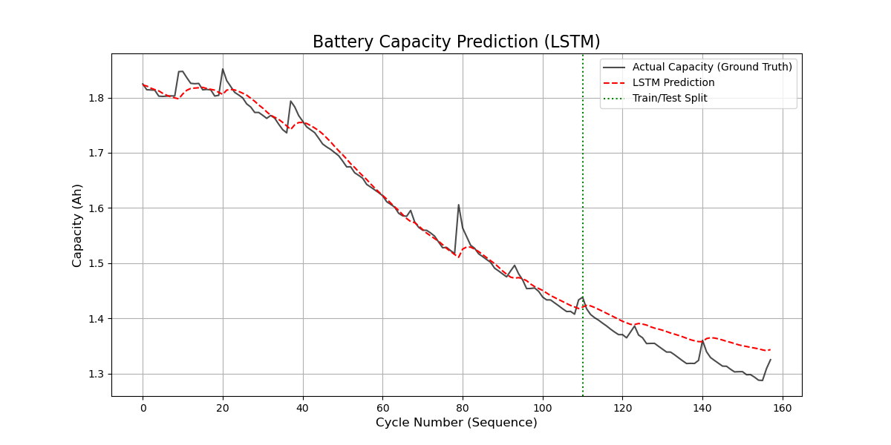

# EV Battery Degradation Prediction with LSTM
(EVバッテリーの劣化予測モデル)

## 📌 Overview
NASAの公開データセットを用いて、リチウムイオン電池の劣化状態（SOH: State of Health）を予測するPoCプロジェクトです。
時系列データ（電圧、電流、温度）からLSTMモデルを用いて将来の容量（Capacity）を予測し、バッテリーの残寿命（RUL）推定への応用を目指しています。

## 📊 Key Results
- **Model**: LSTM (Long Short-Term Memory) with PyTorch
- **Performance**: 
  - Test RMSE: 0.02 Ah (approx.)
  - Error Rate: < 2.0%
- **Visualization**:
  
  

## 🛠 Tech Stack
- **Language**: Python 3.10
- **Framework**: PyTorch
- **Libraries**: Pandas, NumPy, Scikit-learn, Seaborn, Matplotlib
- **Dataset**: NASA PCoE Battery Dataset (B0005)

## 🚀 How to Run
1. Clone this repository
git clone https://github.com/yourusername/ev-battery-prediction.git

text
2. Install requirements
pip install -r requirements.txt

text
3. Run the notebook
Open `notebooks/02_model_training.ipynb` and execute cells.

## 📂 Directory Structure
.
├── data/ # Dataset (not included in git)
├── notebooks/ # Jupyter Notebooks for analysis & training
├── src/ # Python scripts for data loading
├── assets/ # Images for README
└── README.md

text

## 💡 Future Work (改善案)
- 特徴量の追加（電圧プロファイルの変化量など）
- Attention機構の導入による精度向上
- 異なるバッテリーセル（B0006, B0007）への汎化性能検証

## 👤 Author
- [Your Name / Link]
今すぐやるべきこと
画像の保存: 先ほど作成したグラフを prediction_result.png という名前で保存してください（plt.savefig('prediction_result.png') をコードの最後に足せばOK）。

README作成: 上記のテキストをコピペして README.md を作成。

GitHubへPush: これで全世界に公開できる状態になります。

ここまで出来たら、このPoCプロジェクトは完成と言っていいでしょう。自信を持って職務経歴書に**「自己研鑽：EVバッテリー劣化予測モデルの開発（NASAデータセット、PyTorch）」**と書けます！

このreadmeはどこのディレクトリに置くべき？リポジトリの最初？
はい、その通りです。README.md は**リポジトリのルートディレクトリ（一番上の階層）**に置くのが定石です。

GitHubなどのサービスは、リポジトリのトップページを開いたときに、ルートにある README.md を自動的に表示してくれる仕様になっています。

推奨の配置図
現在のあなたのPC上のフォルダ構成は、以下のようになっているのが理想です。

text
ev-battery-degradation-prediction/  
├── .git/                  (Gitの管理フォルダ: 隠しフォルダ)
├── data/
│   └── nasa_battery/
│       └── B0005_summary.csv
├── notebooks/
│   ├── 01_data_loader_EDA.ipynb
│   └── 02_model_training.ipynb
├── src/
│   └── data_loader.py
├── assets/                
│   └── prediction_result.png
├── README.md             
├── requirements.txt      
└── .gitignore            
